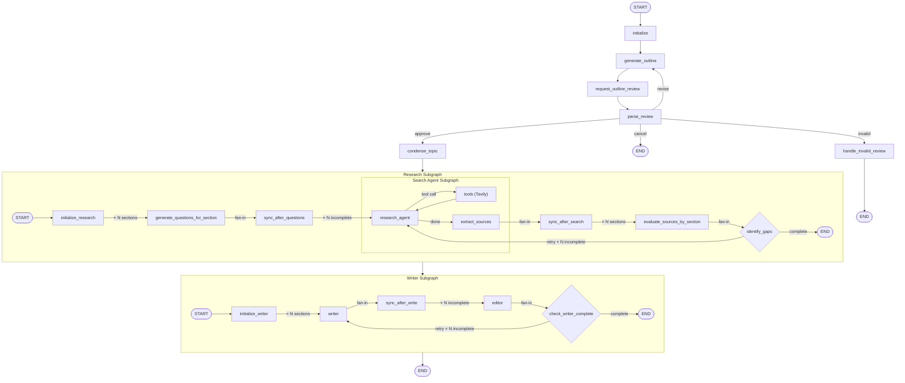

# LangGraph Research Assistant

A multi-agent research pipeline built with LangGraph. Given a topic, it collaborates with the user to build a research outline, then autonomously gathers and evaluates sources, and produces a structured report.

## Features

- **Human-in-the-loop outline review** — the user can approve, revise, or cancel the outline before research begins
- **Parallel fan-out/fan-in research** — questions and source searches run concurrently per section using LangGraph's `Send` API, then merge via sync nodes
- **Agentic search loop** — a nested search-agent subgraph uses Tavily tool calls in a ReAct loop, with a safety cap to prevent infinite tool use
- **Iterative gap-filling** — after evaluating sources, the graph identifies coverage gaps and routes back to search for incomplete sections (up to 3 iterations)
- **Parallel writing and editing** — sections are drafted and reviewed concurrently, with per-section retry routing for insufficient drafts
- **Persistent run state** — each run is tracked in PostgreSQL, enabling future resumption and history

## Architecture notes

The graph has three layers: a top-level outline graph, a research subgraph, and a search-agent subgraph nested inside research.

The search agent uses a dedicated `output_schema` (`SearchAgentOutput`) to expose only `candidate_sources` to the parent graph. Without this, parallel subgraph instances each writing `section_title` to `ResearchState` — with no reducer defined — would raise `INVALID_CONCURRENT_GRAPH_UPDATE`. Scoping the output to only what the parent needs is the correct fix.

Fan-in after parallel nodes is handled by explicit sync nodes (`sync_after_questions`, `sync_after_search`). LangGraph calls these once after all parallel branches complete, which is the right place to update shared state and trigger the next dispatch.

State reducers are defined per-field on `ResearchState` and `WriterState` to handle concurrent writes from parallel nodes: `operator.or_` for dict merges, `add_messages` for the tool-call message list, and a last-write-wins lambda for status strings.

## Tech stack

- **LangGraph** — agent coordination and graph execution
- **OpenAI gpt-4o-mini** — LLM for all nodes
- **Tavily** — web search tool for the research agent
- **FastAPI** — backend API between the graph and the UI
- **React** — frontend UI
- **PostgreSQL** — run state persistence
- **Docker Compose** — local deployment

## Running the app

```bash
docker compose up --build
```

The app will be available at `http://localhost:3000`.

## Running unit tests

Install dependencies first:

```bash
python -m pip install -r requirements.txt
```

Then run tests with:

```bash
python -m pytest tests/unit -q
```

Note: On some systems (especially Windows/PowerShell), `pytest` may not be available as a standalone command even when installed. `python -m pytest ...` is the most portable way to run the test suite.

