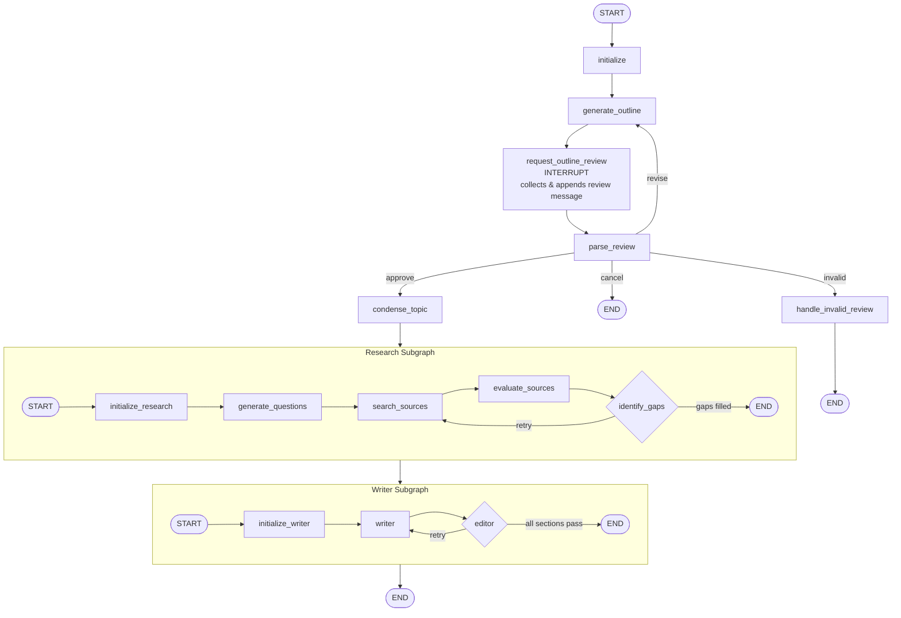

```mermaid
graph TD
    START([START]) --> init[initialize]
    init --> outline[generate_outline]
    outline --> review[request_outline_review\nINTERRUPT\ncollects & appends review message]
    review --> parse[parse_review]

    parse -->|approve| condense[condense_topic]
    parse -->|revise| outline
    parse -->|cancel| END1([END])
    parse -->|invalid| inv[handle_invalid_review]
    inv --> END2([END])

    condense --> R

    subgraph R [Research Subgraph]
        r1([START]) --> r2[initialize_research]
        r2 --> r3[generate_questions]
        r3 --> r4[search_sources]
        r4 --> r5[evaluate_sources]
        r5 --> r6{identify_gaps}
        r6 -->|gaps filled| r7([END])
        r6 -->|retry| r4
    end

    R --> W

    subgraph W [Writer Subgraph]
        w1([START]) --> w2[initialize_writer]
        w2 --> w3[writer]
        w3 --> w4{editor}
        w4 -->|all sections pass| w5([END])
        w4 -->|retry| w3
    end

    W --> END3([END])
```