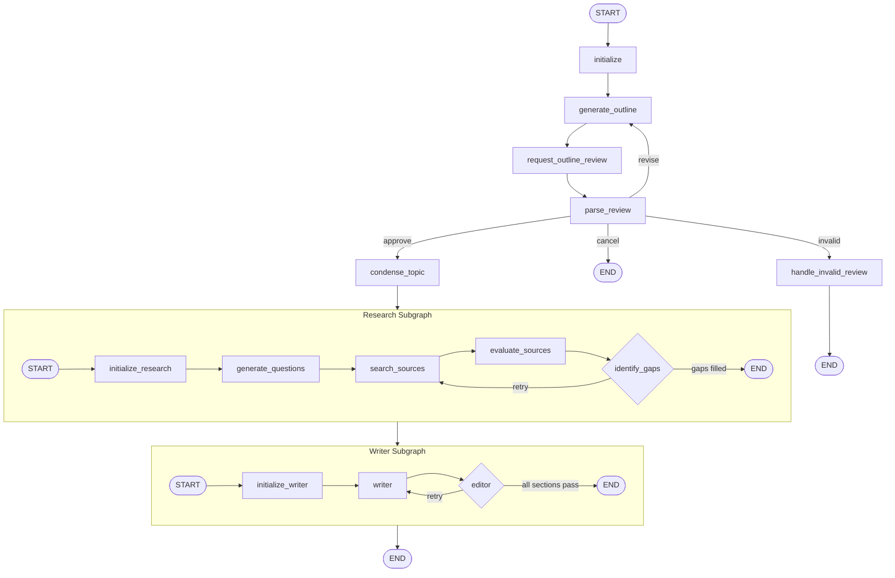

This is a LangGraph Research Assistant app. Run it by entering a user-input. The LLM will generate
a proposed outline for the final report. Either approve that outline or suggest revisions. Repeat this process until a desired outline is generated.

The app's structure contains a main graph with two subgraphs, the reader and writer. The reader subgraph generates questions about a given section,
uses Tavily to search for appropriate sources to answer those questions, evaluates those sources for appropriateness and credibility, and
checks for gaps in the required sources. If gaps are found, the app reroutes to source-gathering. This is repeated until there is sufficient coverage 
across all sections, or three iterations have been run, to prevent infinite loops.
The writer subgraph generates a proposed report and sends it to an editor, who evaluates the product for quality and appropriateness to the outline.
If any sections are found insufficient, they are sent back to the writer node. This process is repeated thrice at most, to prevent infinite loops.
 These exist because both contain domain-specific variables that
are useless elsewhere. A human-in-the-loop interrupt at the outlining phase allows the user more freedom to choose the final contents of the report.

To run, run the docker compose up --build in the langgraph-research-assistant folder. The app will appear on localhost:3000.

Tech Stack:
	LangGraph for agent coordination
	OpenAI gpt-4o-mini for the LLMs themselves
	React.js for the UI
	PostgreSQL to store data on runs
	Tavily to search for appropriate sources of information
	FastAPI to coordinate React.js with the backend

